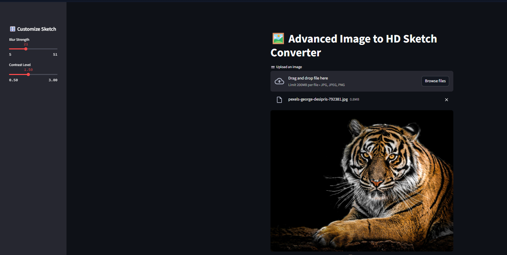
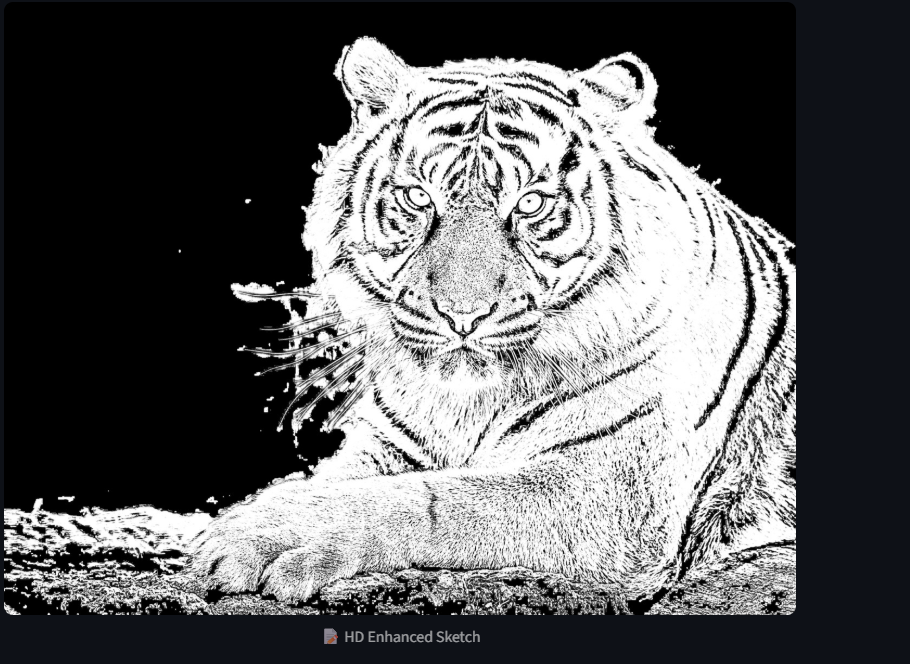

# 🖼️ Sketchify Image Pro

A Streamlit web app to convert your photos into **high-definition pencil sketches** using OpenCV and PIL. Upload, customize, and download your stylized sketch — all in seconds.

---

## 🚀 Features

- 📷 Upload JPG, JPEG, or PNG image
- 🎚️ Adjustable blur strength and contrast
- ✨ Instant high-definition sketch preview
- 📥 Download sketch as PNG
- 🧠 Runs entirely in-browser (no external models)

---

## 📸 Demo Screenshots

### Original Image

### Generated Sketch

---

For app preview click [HERE](https://huggingface.co/spaces/ahmadsanafarooq/Image_to_sketch)