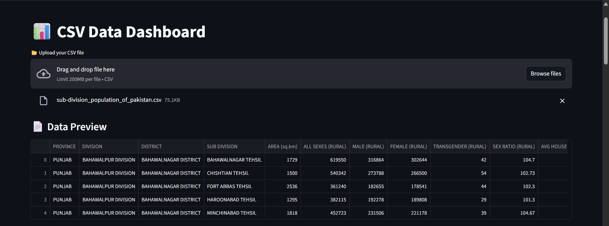
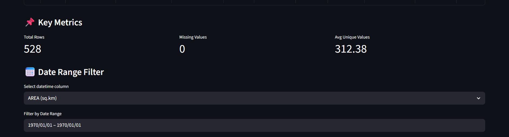
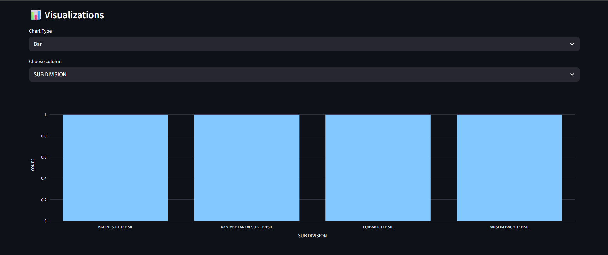
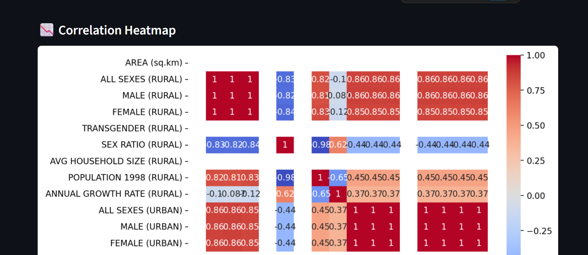
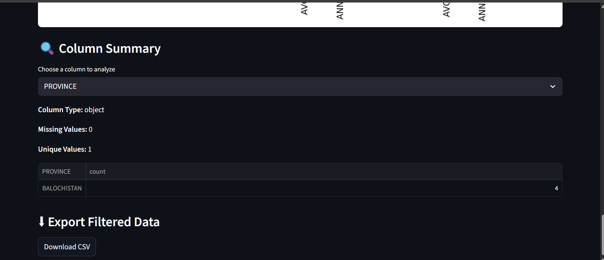

# 📊 CSV Data Dashboard App

An interactive, intelligent Streamlit app to explore, visualize, and analyze any CSV file — perfect for data analysts and enthusiasts!  
Just upload your dataset and get instant charts, heatmaps, KPIs, and download options.

---

## 🚀 Features

- ✅ Upload any `.csv` file
- ✅ Interactive charts (bar, line, scatter, boxplot, histogram)
- ✅ Smart column-type detection (numeric, categorical, datetime)
- ✅ Correlation heatmap
- ✅ Time-series filtering by date
- ✅ Column-level summaries
- ✅ One-click filtered data export

---

## 📸 Screenshots

### 🧾 CSV Preview

### 📈 KPI Metrics + Correlation Heatmap

### 📊 Interactive Charts

### 📅 Time Series & Date Filters

### 🔍 Column Summary + Download Filtered CSV

---
